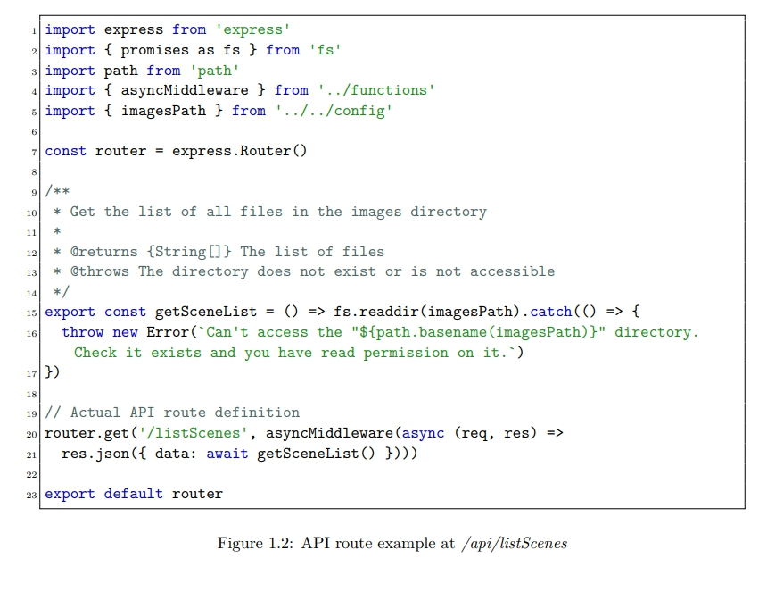

# latex-report-es6

LaTeX report template with JavaScript ES6 and JSON code blocks support.

Includes:

 - JavaScript ES6 and JSON code blocks support
 - Multi-file structure
 - Table of Figures
 - Table of Contents
 - Glossary
 - Common LaTeX commands examples
 - French-language ready (see [Activate french](#activate-french))

## Install required LaTeX packages

### Windows

Install [MikTeX](https://miktex.org/download). It will install the required `pdflatex` command and automatically install required packages when building a tex file.

### Linux

Install [Tex Live](https://www.tug.org/texlive/), I don't know which packages you need to install tbh.

Install the full packages list to make sure you get all you will ever need (4 GB):

```
$ sudo apt-get install texlive-full
```

Linux does not have an equivalent of MikTex to automatically install required packages when building tex files.

## Build

Quick build (`report_output` will be the name of your PDF file):

```
$ cd src
$ pdflatex --jobname=report_output ./main.tex
```

Keep in mind that you need to build it 2 times to make sur LaTeX has generated all required references/Table of Contents files.

Or simply use the provided build script (see [`build.sh`](./build.sh)):

```
$ ./build.sh
```

## Clear log/data files

This will removes all LaTeX build files in the project (src and dist). It does not remove images/tex/pdf in `dist`. It removes pdf files in `src` (see [`clean.sh`](./clean.sh)).

```
$ ./clean.sh
```

## Example

When built, the template will output this PDF file: [`dist/report_output.pdf`](./dist/report_output.pdf).

Example of a ES6 JavaScript code block:



## Activate french

Simply uncomment [this line](./src/config.tex#L10) to turn on french.

A package is already included to fix the copy bug on accentuated characters (when you copy `é` and get `´e` in your clipboard).

## License
[The MIT license](./LICENSE)
